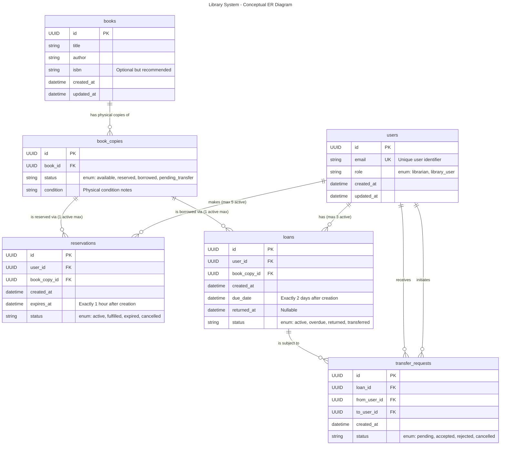

# Database Schema

This document contains the Entity Relationship Diagram (ERD) for the Library System MVP.

## Conceptual ER Diagram

The following diagram details the relationships between the core entities, including business logic constraints as relationship labels.

## Data Types & Annotations

- **PK**: Primary Key
- **FK**: Foreign Key
- **UK**: Unique Key
- The labels on the relationships (e.g., `max 5 active`) reflect the application's constraint rules mapped in the database layer.
