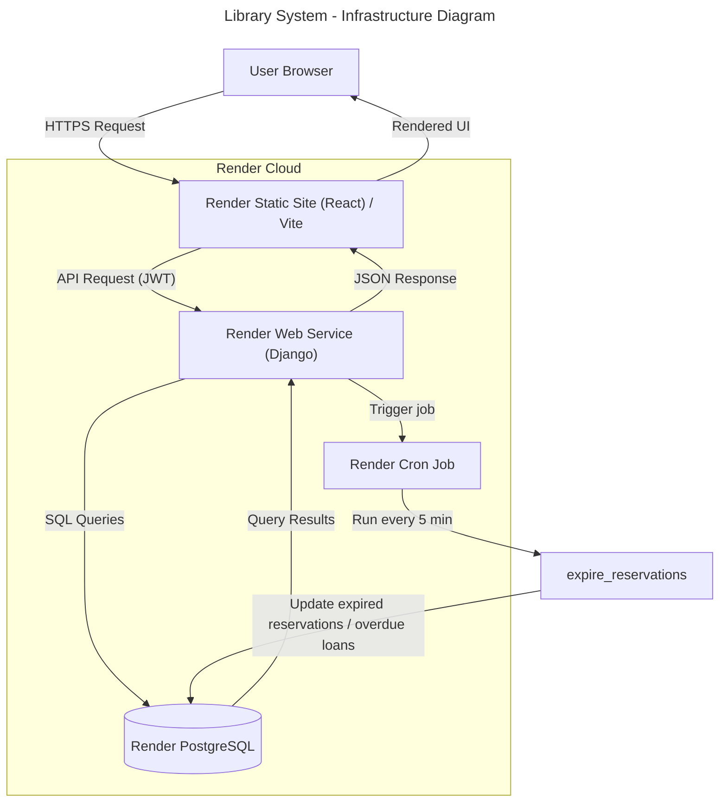

```mermaid
---
title: Library System - Infrastructure Diagram
---
flowchart TD
    Browser[User Browser]

    Browser -->|HTTPS Request| Frontend["Render Static Site (React) / Vite"]
    Frontend -->|"API Request (JWT)"| Backend["Render Web Service (Django)"]
    Backend -->|SQL Queries| DB[(Render PostgreSQL)]

    DB -->|Query Results| Backend
    Backend -->|JSON Response| Frontend
    Frontend -->|Rendered UI| Browser

    Backend -->|Trigger job| Cron[Render Cron Job]
    Cron -->|Run every 5 min| Task[expire_reservations]
    Task -->|Update expired reservations / overdue loans| DB

    subgraph Render Cloud
        Frontend
        Backend
        DB
        Cron
    end
```