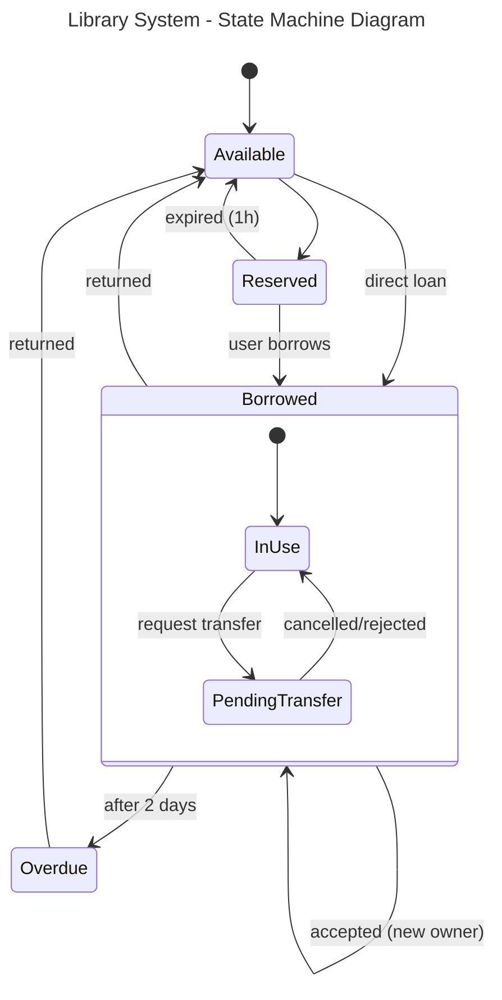

```mermaid
---
title: Library System - State Machine Diagram
---
stateDiagram-v2
    [*] --> Available

    Available --> Reserved
    Available --> Borrowed : direct loan

    Reserved --> Available : expired (1h)
    Reserved --> Borrowed : user borrows

    Borrowed --> Available : returned
    Borrowed --> Overdue : after 2 days

    state Borrowed {
        [*] --> InUse
        InUse --> PendingTransfer : request transfer
        PendingTransfer --> InUse : cancelled/rejected
    }

    Borrowed --> Borrowed : accepted (new owner)
    Overdue --> Available : returned
```