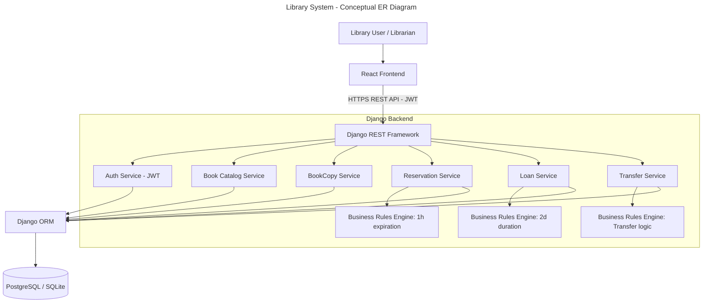

```mermaid
---
title: Library System - Conceptual ER Diagram
---
flowchart TD
    User[Library User / Librarian] --> UI[React Frontend]

    UI -->|HTTPS REST API - JWT| API[Django REST Framework]

    subgraph Backend [Django Backend]
        API --> Auth[Auth Service - JWT]
        API --> Books[Book Catalog Service]
        API --> Copies[BookCopy Service]
        API --> Reservations[Reservation Service]
        API --> Loans[Loan Service]
        API --> Transfers[Transfer Service]

        Reservations --> Rules1[Business Rules Engine: 1h expiration]
        Loans --> Rules2[Business Rules Engine: 2d duration]
        Transfers --> Rules3[Business Rules Engine: Transfer logic]
    end

    %% Conexiones directas a la DB para mayor claridad
    Auth & Books & Copies & Reservations & Loans & Transfers --> ORM[Django ORM]
    ORM --> DB[(PostgreSQL / SQLite)]
```